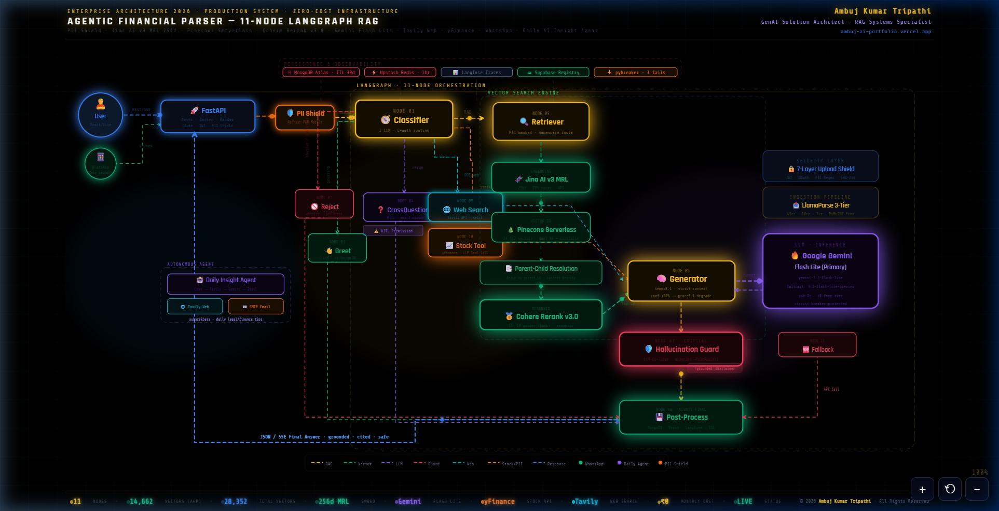

<div align="center">

<!-- Animated Header -->


<br/>

<a href="https://git.io/typing-svg"></a>

<br/>

[](https://agentic-rag-financial-parser.onrender.com)
[](https://ambuj-rag-docs.netlify.app/)
[](https://ambuj-ai-portfolio.vercel.app/)

<br/>

[](https://github.com/Ambuj123-lab/agentic-rag-financial-parser/stargazers)
[](https://github.com/Ambuj123-lab/agentic-rag-financial-parser/network)

[](https://python.org)
[](https://fastapi.tiangolo.com)
[](https://react.dev)
[](https://langchain-ai.github.io/langgraph/)
[](https://docker.com)
[](https://render.com)

</div>

---

## ⚡ What Is This?

An **autonomous, 11-node Agentic RAG pipeline** that parses and queries complex Indian financial & legal documents — Union Budget, Finance Bill, Tax Laws, PF/Pension Schemes, RBI KYC, and Constitution of India — using a purpose-built state machine that **thinks before it answers**.

Unlike traditional RAG (retrieve → generate), this system employs an **agentic flow** where each query passes through specialized nodes that classify intent, cross-question vague queries, guard against hallucinations, and verify answer grounding — all orchestrated via **LangGraph StateGraph**.

---

## 🌿 Branches

| Branch | Description |
|--------|-------------|
| `main` | Production — stable, lean version live on Render (512MB RAM constraints) |
| `v2-local-heavy` | Parallel Vector Retrieval + Cohere Neural Reranking. 👉 **[View Architecture](V2_ARCHITECTURE.md)** |

---

## 🏗️ System Architecture

<div align="center">
<br/>

> **🔮 11-Node LangGraph StateGraph — Animated Architecture**


<br/>
<sub>✨ Classifier → 6-Path Routing → Retrieval → Rerank → Generate → Hallucination Guard → Post-Process</sub>
</div>

---

## 🧠 The 11-Node Agentic RAG Pipeline

| Node | Purpose | Key Detail |
|------|---------|------------|
| **1. Classifier** | Intent detection + 6-path routing | Returns structured JSON: `intent` · `doc_type` · `confidence` · `search_intents` |
| **2. Reject** | Safety guard | Blocks abusive + jailbreak queries with regex blocklist guardrail |
| **3. Greet** | Efficiency bypass | Handles greetings **without** hitting vector DB (zero cost) |
| **4. CrossQuestioner** | HITL clarification | Asks clarifying questions for vague queries (max 2 rounds) |
| **5. Retriever** | Dual vector search | Jina MRL → Pinecone → Parent-Child Resolution → Cohere Rerank Top 10 |
| **6. Web Search** | Out-of-scope fallback | Tavily API — only fires after HITL user permission |
| **7. Stock Tool** | Native LLM tool calling | Gemini `functionDeclarations` + yfinance for live market data |
| **8. Generator** | LLM synthesis | Gemini 3.5 Flash Lite (primary) with `pybreaker` circuit breakers |
| **9. HallucinationGuard** | Answer verification | LLM-as-Judge — advisory mode (appends disclaimer, doesn't block) |
| **10. PostProcess** | Persistence + streaming | MongoDB + Redis cache + Langfuse tracing + SSE stream |
| **11. Fallback** | Circuit breaker recovery | pybreaker pattern: 3 API failures → graceful fallback message |

---

## 🔧 Tech Stack

<table>
<tr>
<td><b>Category</b></td>
<td><b>Technology</b></td>
<td><b>Purpose</b></td>
</tr>
<tr>
<td rowspan="5"><b>RAG Engine</b></td>
<td>LangGraph StateGraph</td>
<td>11-node autonomous state machine orchestration</td>
</tr>
<tr>
<td>Jina v3 (MRL)</td>
<td>Matryoshka Representation Learning embeddings</td>
</tr>
<tr>
<td>Cohere Neural Reranker</td>
<td>Advanced Stage-2 semantic filtering (V2)</td>
</tr>
<tr>
<td>LlamaParse</td>
<td>LLM-native 3-tier document parsing</td>
</tr>
<tr>
<td>Tavily Search API</td>
<td>Live Web Search fallback for Out-of-Scope queries</td>
</tr>
<tr>
<td rowspan="3"><b>Backend & APIs</b></td>
<td>FastAPI + Uvicorn</td>
<td>Async REST API with SSE streaming</td>
</tr>
<tr>
<td>Authlib + PyJWT</td>
<td>Google OAuth 2.0 + JWT session management</td>
</tr>
<tr>
<td>WhatsApp Meta Cloud API</td>
<td>Real-time user bot interaction via Webhooks</td>
</tr>
<tr>
<td><b>Frontend</b></td>
<td>React 19 + Vite</td>
<td>SPA with lazy loading, dark theme, real-time streaming UI</td>
</tr>
<tr>
<td rowspan="4"><b>Data Layer</b></td>
<td>Pinecone Serverless</td>
<td>14,662 vectors — core brain + ephemeral user uploads</td>
</tr>
<tr>
<td>Supabase (PostgreSQL)</td>
<td>Parent chunk storage + file registry</td>
</tr>
<tr>
<td>MongoDB (Motor)</td>
<td>Async chat history, feedback, user sessions</td>
</tr>
<tr>
<td>Upstash Redis</td>
<td>Semantic caching (<100ms) + rate limiting + analytics</td>
</tr>
<tr>
<td rowspan="3"><b>Reliability</b></td>
<td>Pybreaker</td>
<td>Circuit breaker pattern — 3 failures → auto-open → 30s reset</td>
</tr>
<tr>
<td>Langfuse</td>
<td>Distributed tracing — LLM latency, token usage, cost tracking</td>
</tr>
<tr>
<td>UptimeRobot</td>
<td>GET/HEAD health monitoring — zero cold starts</td>
</tr>
<tr>
<td><b>Deployment</b></td>
<td>Docker (Multi-stage) + Render</td>
<td>Frontend build → backend image → production serve</td>
</tr>
</table>

---

## 📊 Infrastructure Scale

| Metric | Value |
|--------|-------|
| **Total Chunks** | 15,408 (Financial Parser Portfolio) |
| **Live Vectors** | 14,662 high-dimensional vectors in Pinecone (256d MRL) |
| **Documents Indexed** | 20+ Indian Government Acts & Financial Frameworks |
| **Parent Chunks** | Stored in Supabase for full-context retrieval |
| **Cache Latency** | <100ms (Upstash Redis semantic cache) |
| **Rate Limit** | 10 queries/min per user (Redis sliding window) |
| **Session TTL** | 24h auto-cleanup (MongoDB TTL indexes) |

---

## 📄 Documents Indexed

| Category | Documents |
|----------|-----------|
| **Financial** | Union Budget 2024-25, Finance Bill 2024-25, Income Tax Amendments |
| **Pension/PF** | EPF Scheme 1952, EPS Pension Scheme 1995, PMVVY, APY |
| **Banking** | RBI KYC Master Direction 2016, UPI Guidelines |
| **Legal** | Constitution of India, Consumer Protection Act |

---

## 🔐 Security Architecture

```
7-Layer Upload Security Framework
─────────────────────────────────
Layer 1 │ Frontend Gating     │ .pdf only, 10MB limit, accept='.pdf'
Layer 2 │ Magic Byte Verify   │ %PDF- header validation (anti-spoofing)
Layer 3 │ Rate Limiting       │ 5 uploads/day per user+IP (Redis)
Layer 4 │ SHA-256 Dedup       │ Content-hash prevents re-indexing identical files
Layer 5 │ Session Isolation   │ is_temporary: true — auto-deletes on logout
Layer 6 │ TTL Auto-Cleanup    │ MongoDB 24h TTL on chunks + temp_uploads
Layer 7 │ Auth Guard          │ JWT verification on every API endpoint
```

---

## 🚀 Quick Start

### Prerequisites
- Python 3.11+
- Node.js 18+
- API Keys: OpenRouter, Pinecone, MongoDB, Supabase, Google OAuth

### Local Development

```bash
# Clone
git clone https://github.com/Ambuj123-lab/agentic-rag-financial-parser.git
cd agentic-rag-financial-parser

# Backend
python -m venv venv && venv\Scripts\activate  # Windows
pip install -r requirements.txt
cp .env.example .env  # Fill in your API keys
uvicorn app.main:app --reload

# Frontend (new terminal)
cd frontend
npm install && npm run dev
```

### Docker (Production)

```bash
docker build -t financial-parser .
docker run -p 8000:8000 --env-file .env financial-parser
```

---

## 📁 Project Structure

```
agentic-rag-financial-parser/
├── app/
│   ├── main.py              # FastAPI app + SPA serving + health check
│   ├── api/
│   │   ├── auth.py           # Google OAuth + JWT + dev-login
│   │   ├── oauth.py          # Authlib Google client config
│   │   └── upload.py         # 7-layer secure file upload
│   ├── core/
│   │   └── config.py         # Pydantic Settings (env vars)
│   ├── db/
│   │   ├── mongodb.py        # Async Motor client + indexes
│   │   ├── pinecone_client.py # Pinecone Serverless init
│   │   └── supabase_client.py # Supabase PostgreSQL client
│   └── rag/
│       ├── graph.py          # ⭐ 11-Node LangGraph StateGraph
│       ├── routes.py         # Chat endpoints + SSE streaming
│       ├── embedder.py       # Jina v3 MRL embeddings
│       └── chunker.py        # Markdown + recursive splitting
├── frontend/
│   ├── src/
│   │   ├── pages/            # Landing, Dashboard, Admin, AuthCallback
│   │   ├── context/          # AuthContext (JWT state)
│   │   └── api/              # Axios client with interceptors
│   └── vite.config.js        # Dev proxy + code splitting
├── Dockerfile                # Multi-stage: Node build → Python serve
├── requirements.txt          # Pinned Python dependencies
└── .dockerignore             # Minimal Docker context
```

---

## 🌐 Live Links

| Resource | URL |
|----------|-----|
| **🚀 Live Application** | [agentic-rag-financial-parser.onrender.com](https://agentic-rag-financial-parser.onrender.com) |
| **📖 RAG Documentation** | [ambuj-rag-docs.netlify.app](https://ambuj-rag-docs.netlify.app/) |
| **👤 Portfolio** | [ambuj-ai-portfolio.vercel.app](https://ambuj-ai-portfolio.vercel.app/) |
| **💻 Source Code** | [GitHub Repository](https://github.com/Ambuj123-lab/agentic-rag-financial-parser) |

---

## 👨‍💻 Author

**Ambuj Kumar Tripathi**
GenAI Engineer & RAG Systems Specialist | LLMOps

[](https://www.linkedin.com/in/ambuj-kumar-tripathi/)
[](https://github.com/Ambuj123-lab)
[](https://ambuj-ai-portfolio.vercel.app/)

---

<div align="center">


<sub>Built with 🧠 LangGraph • ⚡ FastAPI • ⚛️ React • 🔍 Pinecone • 🐘 Supabase • 🍃 MongoDB • 🔴 Redis</sub>

</div>
<parameter name="Complexity">7
