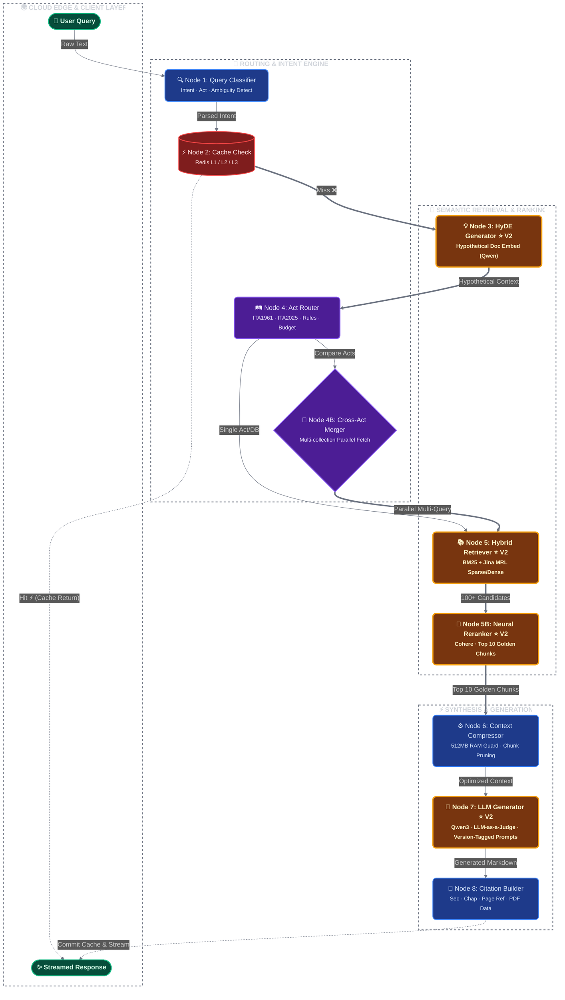

# V2 Agentic Architecture

The V2 branch (`v2-local-heavy`) introduces a massively optimized, heavier execution pipeline running robust vector operations directly on-device.

### Pipeline Upgrades:
- **HyDE Generator (Node 3)**: Introduced to expand search surface area.
- **Hybrid Search (Node 5)**: Utilizing Jina MRL (Matryoshka Representation Learning) truncations + Dense logic.
- **Neural Cohere Reranking (Node 5B)**: Sifting top 15 chunks down to the 10 golden candidates.
- **LLM-as-a-Judge (Node 7)**: Verifying the context directly inside Qwen3 generation.

## Full Agentic StateGraph Execution

