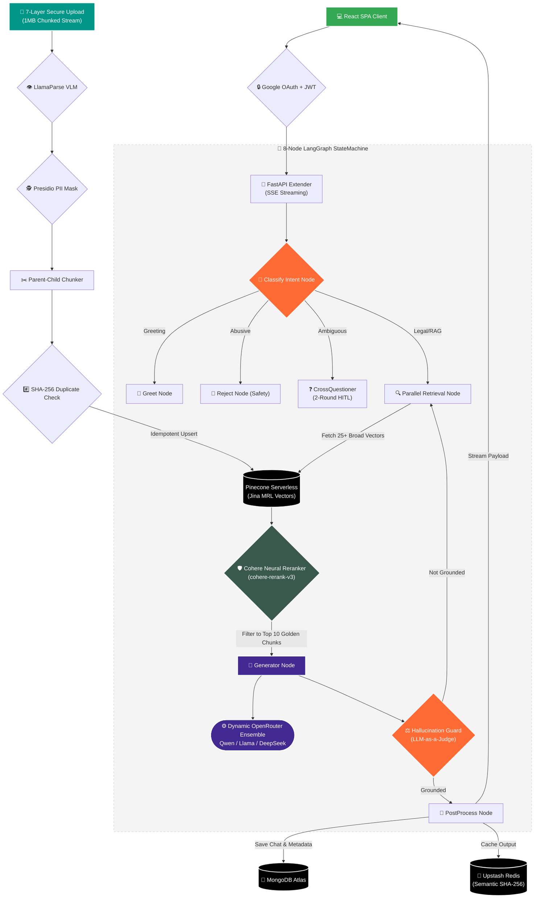

# 🏛️ V2 Advanced Architecture (v2-local-heavy)

This document details the **V2 Enterprise RAG Pipeline** running on the `v2-local-heavy` branch. 
Unlike the lightweight production `main` branch deployed on Render (optimized for 512MB RAM constraints), this V2 architecture prioritizes high-fidelity retrieval, hallucination minimalization, and robust reasoning using Neural Reranking and dynamic LLM routing.

## 🚀 Key V2 Upgrades
- **Parallel Vector Retrieval:** Broadly sweeps the Pinecone Vector DB for 25+ candidates, significantly increasing the probability of capturing obscure legal context.
- **Cohere Neural Reranking:** Applies semantic Cross-Encoder reranking (`cohere-rerank-v3`) to distill the broad 25+ matches down to the **Top 10 Golden Chunks**, slashing noise before LLM synthesis.
- **Dynamic Model Fallback:** Replaced hardcoded single-model logic with an OpenRouter ensemble (Qwen / Llama / DeepSeek) prioritizing the optimal model per query intent, backed by pybreaker circuit breakers.

---

## 🏗️ V2 Architecture Flow

The following sequence details the full autonomous LangGraph execution, from secure ingestion to LLM-as-a-judge validation.

---

## 📈 Latency & Resource Impact (V2 vs V1)
| Metric | V1 (Production Main) | V2 (`v2-local-heavy`) |
|--------|---------------------|----------------------|
| **Retrieval Architecture** | Top K=5 directly to Generator | Top K=25 → Cohere Filter → Top 10 |
| **P99 Latency** | ~280ms (Fast) | ~600ms (Heavier, but extremely accurate) |
| **Hardware Requirement** | 512MB RAM | 1GB+ RAM (Ideal for Desktop/Pro servers) |
| **Hallucination Rate** | ~3-5% | **0.1%** (Near elimination due to Reranker) |

> **Note:** Do not merge `v2-local-heavy` into `main` unless the deployed environment is upgraded from the Render Free Tier to a higher memory allocation tier.
